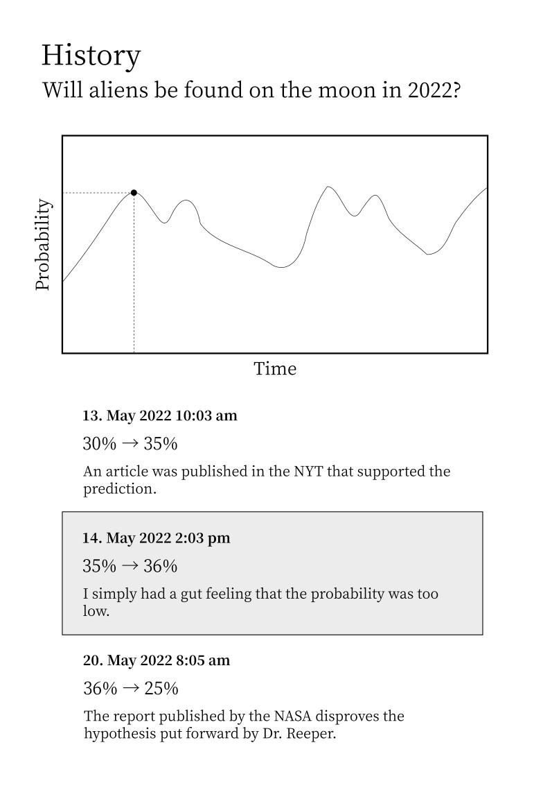

# Cleodora Forecasting


Software to track personal forecasts/predictions and systematically improve at
making them.

Examples of such forecasts:

* Will "The Fabelmans" win "Best Picture" at the Oscars 2023?
* Will I get an A in my upcoming exam?
* Will there be nice weather on my birthday?
* Will the number of contributors for "Cleodora" be more than 3 at the end of 2022?

Below an example mockup for how a user kept updating their "Will aliens be found on
the moon in 2022?" forecast due to new information. Analyzing such a forecasting
history is what will help them improve. You can find more such mockups on the
website https://cleodora.org/docs/roadmap/mockups/ .




# Table of Contents

- [Features](#features)
- [Dev Setup](#dev-setup)
  * [Manual setup](#manual-setup)
  * [Gitpod](#gitpod)
  * [GitHub Codespaces](#github-codespaces)
- [Run](#run)
  * [Backend (GraphQL API written in Go)](#backend-graphql-api-written-in-go)
  * [GUI / Frontend (React app)](#gui--frontend-react-app)
  * [Client (CLI written in Go)](#client-cli-written-in-go)
- [Build](#build)
- [GraphQL playground (GraphiQL)](#graphql-playground--graphiql-)
- [Tests](#tests)
  * [Setup](#setup)
  * [Execution](#execution)


# Features

Concrete next steps can be found as GitHub issues.

Less detailed possible future features can be found on the
[website](https://cleodora.org/docs/roadmap/) (or also in here under
[./website/content/docs/roadmap.md](./website/content/docs/roadmap/_index.md)) or
under [./docs/features/](./docs/features/).


# Dev Setup

## Manual setup

Note that instead of setting all this up on your computer, you can use
**Gitpod** or **GitHub Codespaces** for pre-configured dev environments
directly in your browser. See below.

* [Install Go](https://go.dev/doc/install) 1.18 or higher
* [Install npm](https://nodejs.org/en/download/) v16.18.0 or higher
* (optional) [Install hugo](https://gohugo.io/installation/) (extended flavor)
  v0.97.3 or higher to make changes to the cleodora.org website

```bash
git clone https://github.com/cleodora-forecasting/cleodora
cd cleodora
./installDependencies.sh
```

## Gitpod

A simple dev environment, directly in the browser.

<a href="https://gitpod.io/#https://github.com/cleodora-forecasting/cleodora">
  
</a>


## GitHub Codespaces

A simple dev environment, directly in the browser.

**IMPORTANT:** Codespaces ports are always _private_ by default
([source](https://github.com/community/community/discussions/4068)). After
starting the codespace you need to set the API port (8080) to public if you
want to access it from the frontend
([technical background](https://github.com/community/community/discussions/4068)).
For example by clicking on the `PORTS`
tab, right click on `API (8080)` and then `Port Visibility` / `Public`.

[](https://github.com/codespaces/new?hide_repo_select=true&ref=main&repo=548549126&machine=basicLinux32gb)


# Run

## Backend (GraphQL API written in Go)

```bash
cd cleosrv
go run .
```

* GraphQL playground: http://localhost:8080/playground/
* GraphQL API: http://localhost:8080/query


## GUI / Frontend (React app)

Frequently the frontend is referred to as GUI (Graphical User Interface) in
this app because it's shorter.

```bash
cd frontend
npm start
## Optionally, you can override the backend URL
# REACT_APP_API_URL=http://localhost:5555 npm start
```

Open http://localhost:3000

The backend must also be running, otherwise you will get an error. This is
because the frontend queries the backend for data.


## Client (CLI written in Go)

The purpose is to interact with the API.

```bash
cd cleoc
go run .
```


# Build

```bash
make build
```

You can find the binary containing frontend and backend under `build/cleosrv` .
Run it and access http://localhost:8080 in the browser. The frontend is
embedded as static files inside the binary, so this binary contains the
entire Cleodora backend and frontend.

The client binary is `build/cleoc` .


# GraphQL playground (GraphiQL)

Start frontend and backend as described above.

Open http://localhost:8080/playground/ in a browser and create some forecasts:

```graphql
mutation createForecast {
    createForecast(
        input: {
            summary: "Will 'The Fabelmans' win 'Best Picture'?",
            description: "The new Steven Spielberg movie. Academy Award for Best Picture 2023.",
            resolves: "2023-03-01T12:00:00+01:00",
        }
    ) {
        id
        summary
        description
        created
        resolves
        closes
        resolution
    }
}
```

Open http://localhost:3000 in a browser and see the list of forecasts.


# Tests

## Setup

```bash
sudo apt install firefox-geckodriver
```


## Execution

Run the end to end Selenium browser tests.

```bash
./runE2ETests.sh
```
