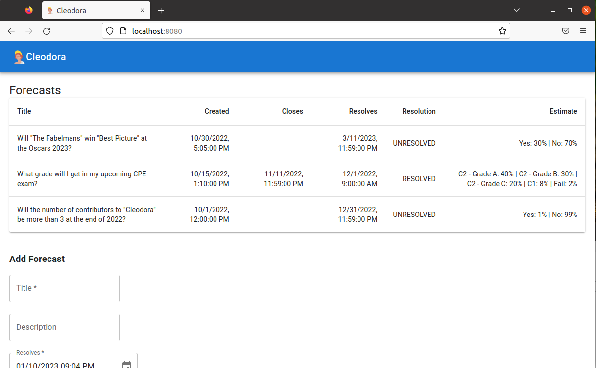

# Cleodora Forecasting

<!-- ALL-CONTRIBUTORS-BADGE:START - Do not remove or modify this section -->

<!-- ALL-CONTRIBUTORS-BADGE:END -->

See the [Cleodora Demo](https://demo.cleodora.org/).

Software to track personal forecasts/predictions and systematically improve at
making them.

Examples of such forecasts:

* Will "The Fabelmans" win "Best Picture" at the Oscars 2023?
* Will I get an A in my upcoming exam?
* Will there be nice weather on my birthday?
* Will the number of contributors for "Cleodora" be more than 5 at the end of
  2023?

# Contributing

We are always looking for people to contribute! Please check the [Contributing
Guide](CONTRIBUTING.md) to get started. Then you can check the [Development
Documentation](dev_docs/).

You'll also find the [roadmap](dev_docs/roadmap/),
[dev guidelines](dev_docs/dev_guidelines.md) or a list of
[technologies](dev_docs/technology.md) there.

# User Documentation

How to install, configure and run Cleodora. Check the website
[cleodora.org/docs/user](http://cleodora.org/docs/user).

# Changelog

See [cleodora.org/docs/changelog](https://cleodora.org/docs/changelog).

# Contributors

Thanks go to these wonderful people ([emoji meaning](https://allcontributors.org/docs/en/emoji-key)):

<!-- ALL-CONTRIBUTORS-LIST:START - Do not remove or modify this section -->
<!-- prettier-ignore-start -->
<!-- markdownlint-disable -->
<table>
  <tbody>
    <tr>
      <td align="center" valign="top" width="14.28%"><a href="https://www.schafe-sind-bessere-rasenmaeher.de/"> <b>Robert Lützner</b></a> <a href="#userTesting-rluetzner" title="User Testing">📓</a></td>
      <td align="center" valign="top" width="14.28%"><a href="https://github.com/omarkohl"> <b>Omar Kohl</b></a> <a href="https://github.com/cleodora-forecasting/cleodora/commits?author=omarkohl" title="Code">💻</a> <a href="https://github.com/cleodora-forecasting/cleodora/issues?q=author%3Aomarkohl" title="Bug reports">🐛</a> <a href="#content-omarkohl" title="Content">🖋</a> <a href="https://github.com/cleodora-forecasting/cleodora/commits?author=omarkohl" title="Documentation">📖</a> <a href="#ideas-omarkohl" title="Ideas, Planning, & Feedback">🤔</a> <a href="#platform-omarkohl" title="Packaging/porting to new platform">📦</a> <a href="#promotion-omarkohl" title="Promotion">📣</a> <a href="https://github.com/cleodora-forecasting/cleodora/commits?author=omarkohl" title="Tests">⚠️</a> <a href="#userTesting-omarkohl" title="User Testing">📓</a></td>
    </tr>
  </tbody>
</table>

<!-- markdownlint-restore -->
<!-- prettier-ignore-end -->

<!-- ALL-CONTRIBUTORS-LIST:END -->
<!-- prettier-ignore-start -->
<!-- markdownlint-disable -->

<!-- markdownlint-restore -->
<!-- prettier-ignore-end -->

<!-- ALL-CONTRIBUTORS-LIST:END -->

This project follows the [all-contributors](https://allcontributors.org/) specification.
Contributions of any kind are welcome!

It also uses the [all-contributors bot](https://allcontributors.org/docs/en/bot/usage)
so you can easily add yourself or others to the list of contributors.
